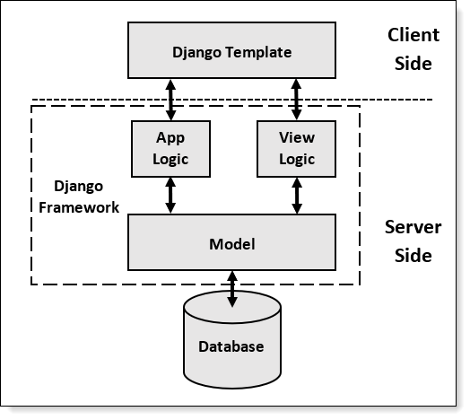
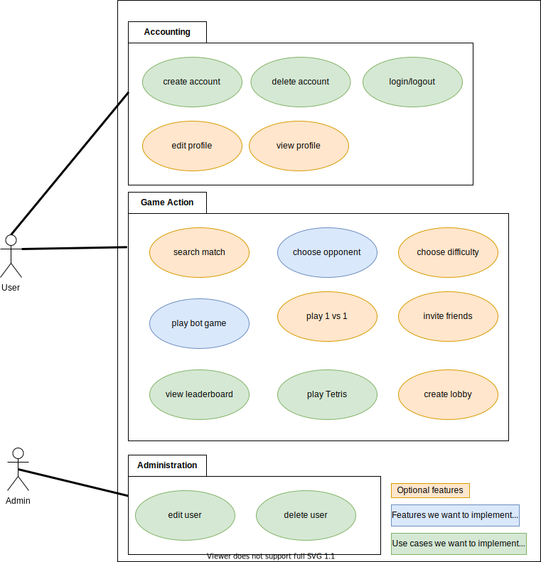
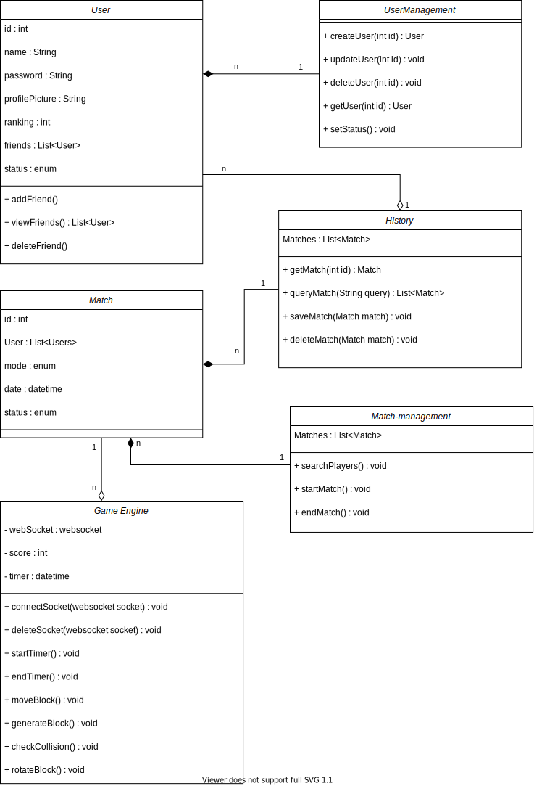
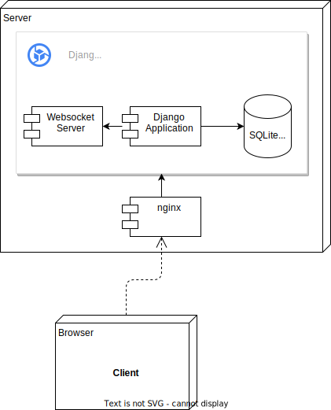

# Software Architecture Document

# Table of Contents

- [Introduction](#1-introduction)
    - [Purpose](#11-purpose)
    - [Scope](#12-scope)
    - [Definitions, Acronyms and Abbreviations](#13-definitions-acronyms-and-abbreviations)
    - [References](#14-references)
    - [Overview](#15-overview)
- [Architectural Representation](#2-architectural-representation)
- [Architectural Goals and Constraints](#3-architectural-goals-and-constraints)
- [Use-Case View](#4-use-case-view)
    - [Use-Case Realizations](#41-use-case-realizations)
- [Logical View](#5-logical-view)
    - [Overview](#51-overview)
    - [Architecturally Significant Design Packages](#52-architecturally-significant-design-packages)
- [Process View](#6-process-view)
- [Deployment View](#7-deployment-view)
- [Implementation View](#8-implementation-view)
    - [Overview](#81-overview)
    - [Layers](#82-layers)
- [Data View](#9-data-view)
- [Size and Performance](#10-size-and-performance)
- [Quality](#11-quality)

## 1. Introduction

### 1.1 Purpose

This document provides a comprehensive architectural overview of the system, using a number of different architectural
views to depict different aspects of the system. It is intended to capture and convey the significant architectural
decisions which have been made on the system.

### 1.2 Scope

The scope of this SAD is to show the architecture of the 13TRIS project. Affected are the class structure, the use cases
and the data representation.

### 1.3 Definitions, Acronyms and Abbreviations

|Abbreviation|Explanation                        |
|------------|-----------------------------------|
|SAD         |Software Architecture Document     |
|MVC         |Model-View-Controller              |
|SRS         |Software Requirements Specification|

### 1.4 References

External resources used in this document:

- Classic architectural representation of a Django application: https://djangobook.com/mdj2-django-structure/
- SRS document of the 13TRIS project: https://github.com/13TRIS/13TRIS/blob/main/docs/SRS.md
- Repository with information about Django: https://github.com/fgervasi-cell/Django-E-Portfolio.
- How to deploy a Django application: https://developer.mozilla.org/en-US/docs/Learn/Server-side/Django/Deployment

### 1.5 Overview

The architectural details will be described in the following sections. This includes the architectural representation of
a typical Django application, the use cases diagram and class diagram which gives an overview about the whole project.

## 2. Architectural Representation

  
This is an example structure for a Django project borrowed from [this](https://djangobook.com/mdj2-django-structure/)
site. Django-apps are built upon the MVC pattern which describes three main components of an application.

1. The **view** that contains everything that the user can see and interact with. It is important to note that views
   should not contain any logic if possible.
2. **Models** represent the data with which the application operates. They also contain the logic to retrieve the data
   from a database or some other source of information.
3. The **Controller** is responsible for processing requests and negotiating between the view and model based on
   well-defined parameters.

In the case of Django views are represented by **Django Templates** which are nothing more than HTML pages with the
possibility to include some logic to process data that should be displayed. Models are represented as Python classes in
the **models.py** file inside the Django project. They are an abstraction of database tables. The Controller is defined
in the **views.py** file as a set of Python functions mapped to specific URLs.

For more information about Django and using the MVC pattern look at this
repository: https://github.com/fgervasi-cell/Django-E-Portfolio.

## 3. Architectural Goals and Constraints

To have all benefits of the MVC pattern, we decided to use Django as MVC framework. We are using it in the backend as
well as the frontend. To design our views (aka Django templates), we use Bootstrap, which is not part of this document.

## 4. User-Case View

### 4.1 Use-Case Realizations

See the [SRS](SRS.md) for further detail.

## 5. Logical View

### 5.1 Overview

**n / a**

### 5.2 Architecturally Significant Design Packages

Here you can see our class diagram:  

## 6. Process View

**n / a**

## 7. Deployment View

We still have to decide where we want to deploy our application. There seem to be a lot of choices. More info can be
found [here](https://developer.mozilla.org/en-US/docs/Learn/Server-side/Django/Deployment).  
Popular choices are:

- Heroku
- Python Anywhere
- AWS
- Azure

Another possibility for us to deploy our application is to deploy it on a private Raspberry Pi (see the diagram below).

## 8. Implementation View

### 8.1 Overview

**n / a**

### 8.2 Layers

**n / a**

## 9. Data View

We plan on using a SQLite database to store user related data because it is built into Django. However, we do not have a
DB schema yet. We are working on the database and add this part later.

--missing--

## 10. Size and Performance

**n / a**

## 11. Quality

**n / a**