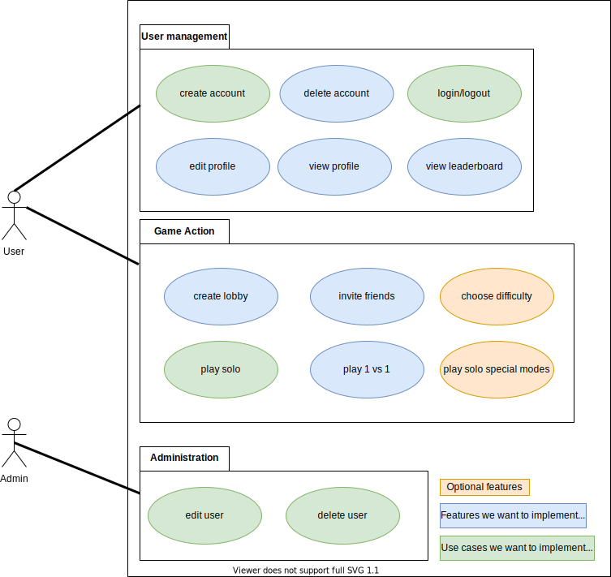

# Software Architecture Document

## 1. Introduction

### 1.1 Purpose

This document provides a comprehensive architectural overview of the system, using a number of different architectural
views to depict different aspects of the system. It is intended to capture and convey the significant architectural
decisions which have been made on the system.

### 1.2 Scope

The scope of this SAD is to show the architecture of the 13TRIS project. Affected are the class structure, the use cases
and the data representation.

## 2. Architectural Representation

  
This is an example structure for a Django project borrowed from [this](https://djangobook.com/mdj2-django-structure/)
site.

## 3. Architectural Goals and Constraints

To have all benefits of the MVC pattern, we decided to use Django as MVC Framework. We are using it in the
Backend as well as the Frontend. To design our Views, we use Bootstrap, which is not part of this document.

## 4. User-Case View

See the [SRS](SRS.md) for further detail.

## 5. Logical View

**n / a**

## 7. Deployment View

We still have to decide where we want to deploy our application. There seme to be a lot of choices. More info can be
found [here](https://developer.mozilla.org/en-US/docs/Learn/Server-side/Django/Deployment).  
Popular choices are:  
- Heroku
- Python Anywhere
- AWS
- Azure

## 8. Implementation View

**n / a**

## 9. Data View

We plan on using a SQLite database to store user related data because it is built into Django. However, we do not have
a DB schema yet.
Here you can see our class diagram:  

## 10. Size and Performance

**n / a**

## 11. Quality

**n / a**