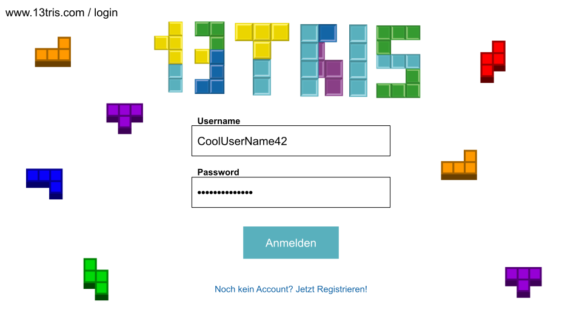
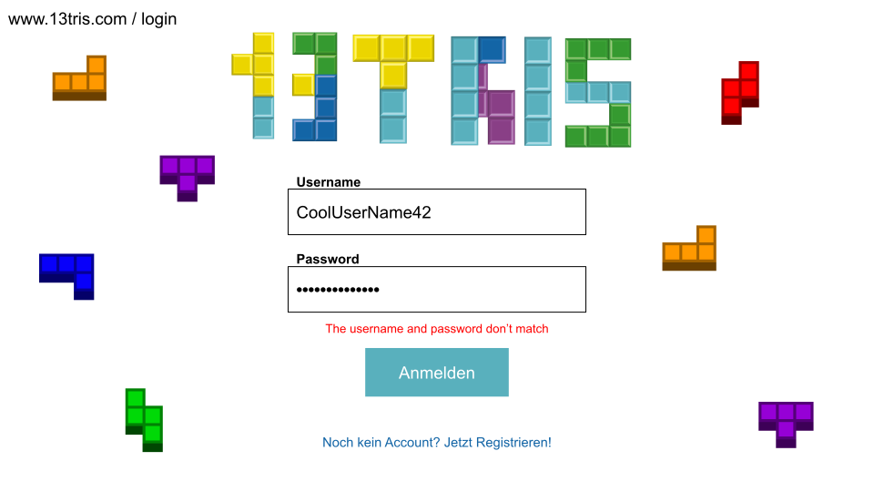

# 1. Use Case Specification: Login

## 1.1 Brief Description
This use case allows users to login to an existing account.
The user has to identify himself with a unique username and a password.

## 1.2 Mockup
### Page to log in to an existing account
The plain login page with both input fields being empty.


## 1.3 Screenshot
### Login functionality "input"
This is how the login page should look when both input fields are filled. It is important to hide the password in the
password field.


### Login functionality "wrong credentials" 
If the user enters a false password or username we have to show an error message.


# 2. Flow of Events

## 2.1 Basic Flow
Here is the activity diagram for logging in to an existing account. First the user visits the login page which is loaded
from the backend. After entering credentials and pressing the login button the backend checks if the credentials are correct.
If not an error is shown to the user otherwise the user will be forwarded to the home page of the application.  


## 2.2 Alternative Flows
n/a

## 2.3 Narrative
```gherkin
Feature: Login
  As a USER
  I want to visit the login page and be able to fill in my credentials and login to my account.

Background:
  Given The user visited the login page

  Scenario: Login successful
    Given I have an account
    When I fill in the correct credentials
    And I click the "Login" button
    Then I should be redirected to my personal home page
    And I should see my friends list
    And I should see my username
    And I should see the game selection
    And I should see the leaderboard

  Scenario: Login unsuccessful
    Given I have an account
    When I fill in the wrong credentials
    And I click the "Login" button
    Then I should see the error message "The username and password don't match" beneath the input fields
```

# 3. Special Requirements
n/a

# 4. Preconditions
The main preconditions for this use case are:

 1. The user has a registered account.
 2. The user needs no valid cookie (otherwise he will be logged in automatically)
 3. The user needs to enter correct credentials
 4. The backend must be running

# 5. Postconditions

### 5.1 Update backend
The backend should mark the user as logged in.

# 6. Extension Points
n/a
