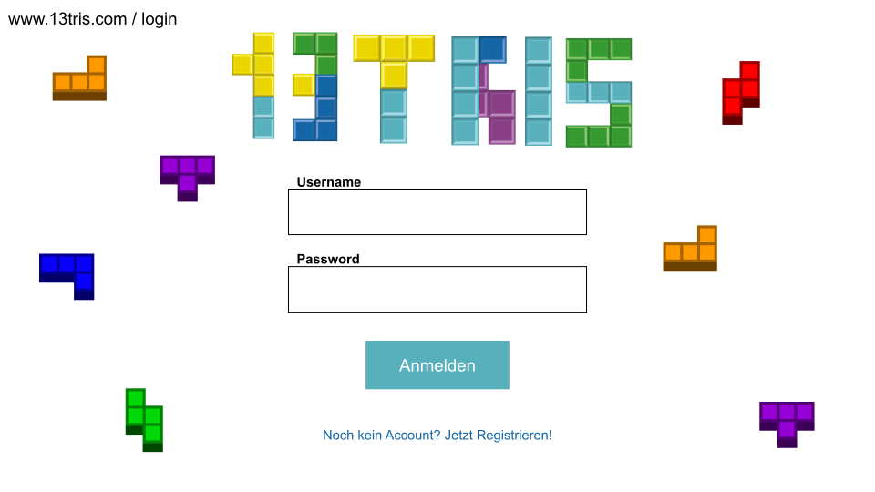
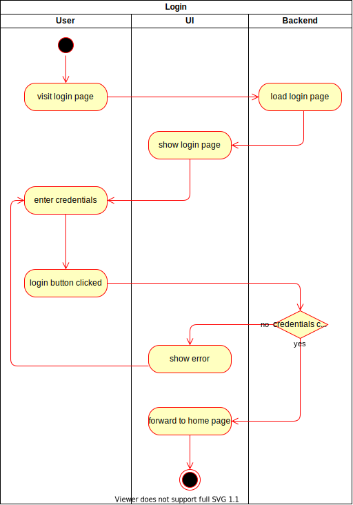

# 1. Use Case Specification: Create Account

## 1.1 Brief Description
This use case allows users to add products/items to a shopping list.
A product has a title and may contain information like the number of items and who the product shall be bought for.

## 1.2 Mockup
### Page to log in to an existing account

## 1.3 Screenshot
### Add Item functionality "blank"

### Add Item functionality "input"

### Add Item functionality "select users"

### Updated Shopping List

# 2. Flow of Events

## 2.1 Basic Flow
Here is the activity diagram for adding a new item/product.  

And here is a screenshot of the `.feature` file for this use case:

## 2.2 Alternative Flows
n/a

# 3. Special Requirements
n/a

# 4. Preconditions
The main preconditions for this use case are:

 1. The users app instance is registered.
 2. The user is member of a group/shared flat.
 3. The user has started the app and has navigated to "Shopping List".

# 5. Postconditions

### 5.1 Save changes / Sync with server
If a product has been added it must be synced with the server.

# 6. Function Points
To calculate function points, we used the tool on [http://groups.umd.umich.edu](http://groups.umd.umich.edu/cis/course.des/cis375/projects/fp99/main.html).

For this use case we got a score of *54* function points. It took 720min to implement this use case.

