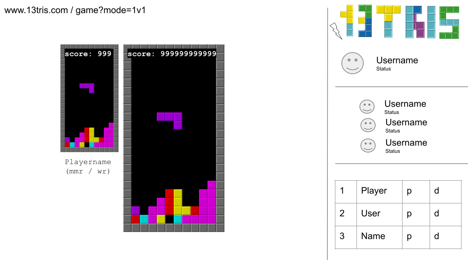
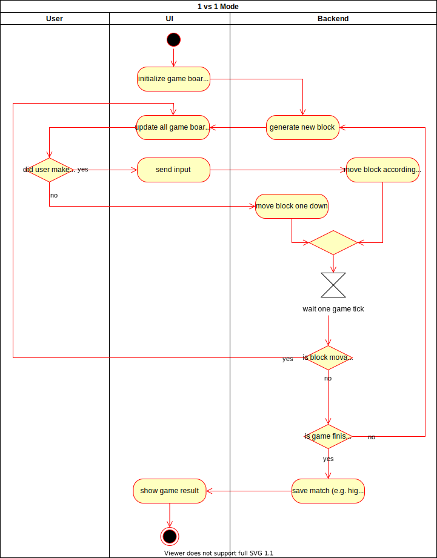

# 1. Use Case Specification: Play 1 vs 1

## 1.1 Brief Description
This use case allows users to play against another human player.
The game ends if the blocks stack up to the top of the board of one player.
This player will lose while the other player will win the game.

## 1.2 Mockup 
### Page to play a 1vs1 match


## 1.3 Screenshot
### Versus game Functionality "match lost"
When one of the players has lost the game we need to show game over screen to this player. The other player will see that he 
won the game. Other information like the score need to be shown as well.


### Versus game Functionality "match won"
When one of the players has lost the game we need to show a victory message to the other player. 
Other information like the score need to be shown as well.


# 2. Flow of Events

## 2.1 Basic Flow
Here is the activity diagram for playing a 1vs1 game. First the game board will be initialized for both players and a new random block is generated.
Afterwards the game will constantly be updated while the users have the ability to perform different actions like moving or rotating
the block. All the inputs will be sent to the backend which checks for each player if the block is actually still movable. If not the game might
be finished or a new block has to be generated for this player. At the end the game has to be saved to the history of both players.
Based on the results of the game one player will be prompted that he won and the other one will be prompted that he lost.


## 2.2 Alternative Flows
n/a

## 2.3 Narrative
```gherkin
Feature: Play 1vs1
  As a USER I
  want to play Tetris against another person.

  Background:
    Given The user is logged in
    And The user selected the game card "1vs1"

  Scenario: Player joins 1vs1 game
    Given I have the status "searching"
    When I am matched against another player
    Then My status should be updated to "playing"
    And I am redirected to the game page
    And I should be able to make inputs
```

# 3. Special Requirements
n/a

# 4. Preconditions
The main preconditions for this use case are:
1. Both users have an account
2. Both users are currently in the same lobby
3. The connection between front- and backend is uninterrupted 


# 5. Postconditions
1. Save information about the match for both players in the database (e.g. score, date, lobby, opponent).
2. Remove the current players from the lobby

# 6. Extension Points
n/a
