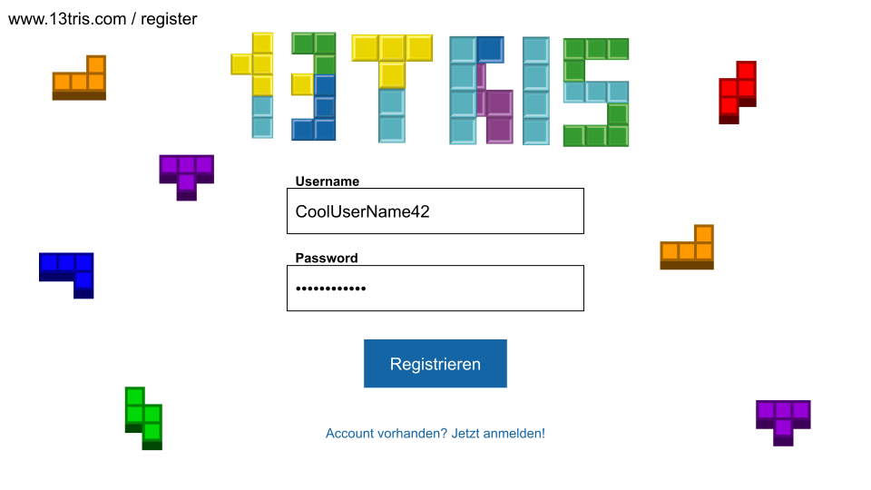
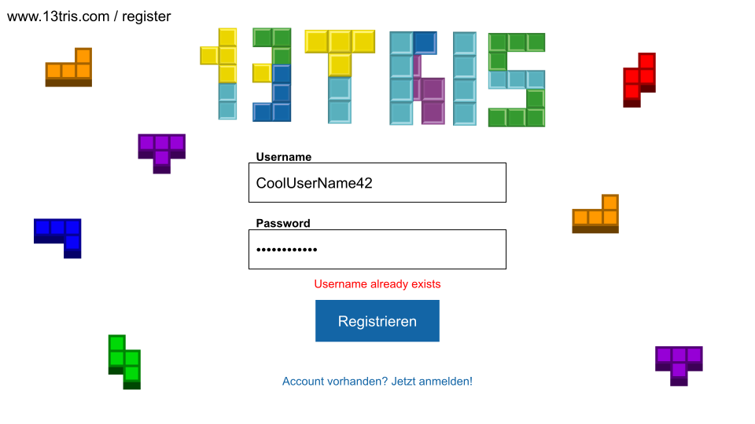
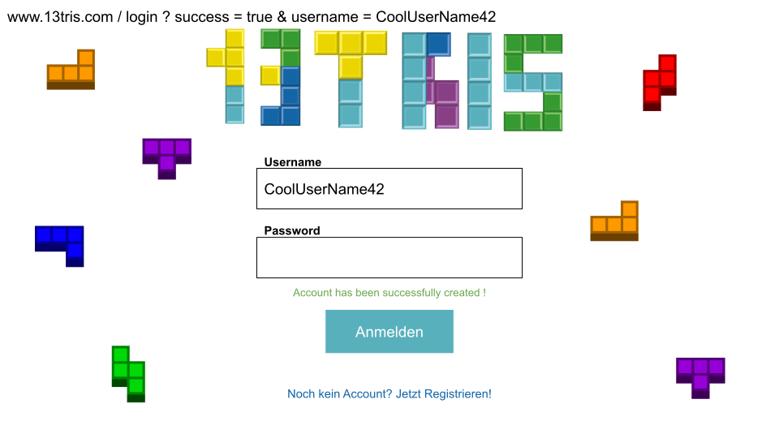
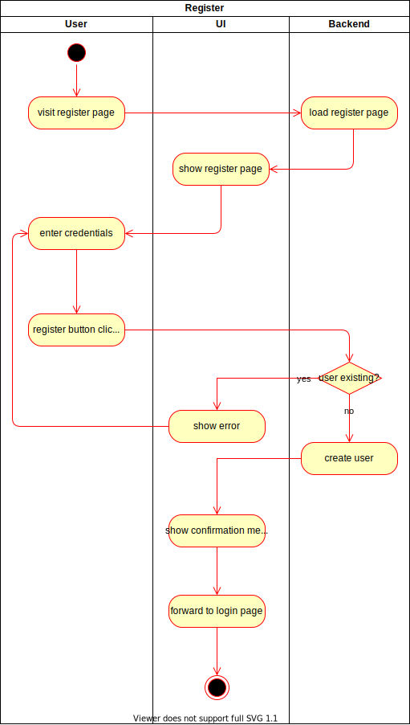

# 1. Use Case Specification: Create Account

## 1.1 Brief Description
This use case allows users to register a new account.
An account is identified by a unique username and a password.

## 1.2 Mockup 
### Page to register a new account
The user is able to fill out the form and register a new account.

## 1.3 Screenshot
### Register functionality "input"
This screenshot shows how the form should look with input. It is important to hide the password field.

### Register functionality "username invalid"
We plan on identifying every user via a unique username. Hence, we have to check if the username which was entered already
exists. If so we should show an error message. We will show a similar error if one of the fields is not filled out while
the register button is being pressed (i.e. both fields are required).

### Register functionality "success"
If the user put in a valid username and password and clicked on the button "Register" we will redirect to the login 
page and show a success message.

# 2. Flow of Events

## 2.1 Basic Flow
Here is the activity diagram for registering an account. If the user visits the register page the page has to be loaded 
from the backend. After the user entered credentials and pressed the "Register" button it has to be checked if the 
password is valid. This has to be done two times in the UI and backend to prevent errors because of manipulation of the
HTML or JavaScript in the browser. Afterwards we verify that the user does not already exist. If not we create the user.  

## 2.2 Alternative Flows
n/a

# 3. Special Requirements
n/a

# 4. Preconditions
The main preconditions for this use case are:
1. The user has to enter a valid password (e.g. with a minimal length, at least one special character, ...)
2. The backend has to be running to save the new user and check if the password is valid

# 5. Postconditions

### 5.1 Save account
The new account has to be saved in the backend together with all its information.

# 6. Extension Points
n/a
