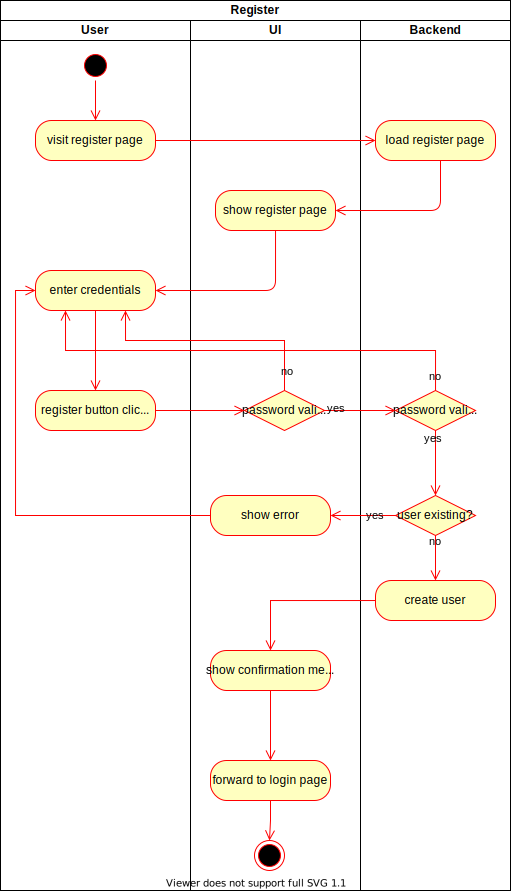

# 1. Use Case Specification: Create Account

## 1.1 Brief Description
This use case allows users to register a new account.
An account is identified by a unique username and a password.

## 1.2 Mockup 
### Page to register a new account

## 1.3 Screenshot
### Register functionality "input"

### Register functionality "username invalid"

### Register functionality "success"

# 2. Flow of Events

## 2.1 Basic Flow
Here is the activity diagram for registering an account.  

## 2.2 Alternative Flows
n/a

# 3. Special Requirements
n/a

# 4. Preconditions
The main preconditions for this use case are:
1. The user has to enter a valid password (e.g. with a minimal length)
2. The backend has to be running to save the new user and check if the password is valid

# 5. Postconditions

### 5.1 Save account
The new account has to be saved in the backend together with all its information.

# 6. Extension Points
n/a
