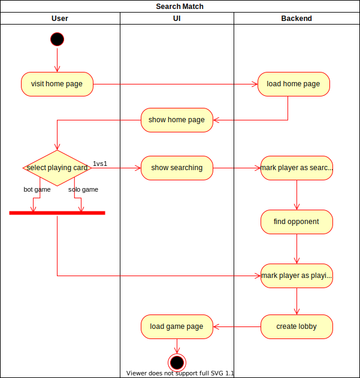

# 1. Use Case Specification: Search a Match

## 1.1 Brief Description

This use case allows users to search for a match. The user can play alone, against a bot or against another player.

## 1.2 Mockup

### Home page after clicking on card to search match (1vs1)

# 2. Flow of Events

## 2.1 Basic Flow

Here is the activity diagram for searching a round of Tetris.  

## 2.2 Alternative Flows

n/a

# 3. Special Requirements

n/a

# 4. Preconditions

The main preconditions for this use case are:

1. The user needs an account
2. Other players need to be searching for a game if playing 1 vs 1
3. The connection should not be interrupted while searching
4. The backend must be functional

# 5. Postconditions

### 5.1 Mark playing

Players in a lobby have to be marked as playing and have their searching tag removed.

### 5.2 Same lobby / same match

Players are put into the same lobby / same match. One player should not be match against another player form another
lobby.

# 6. Extension Points

n/a
