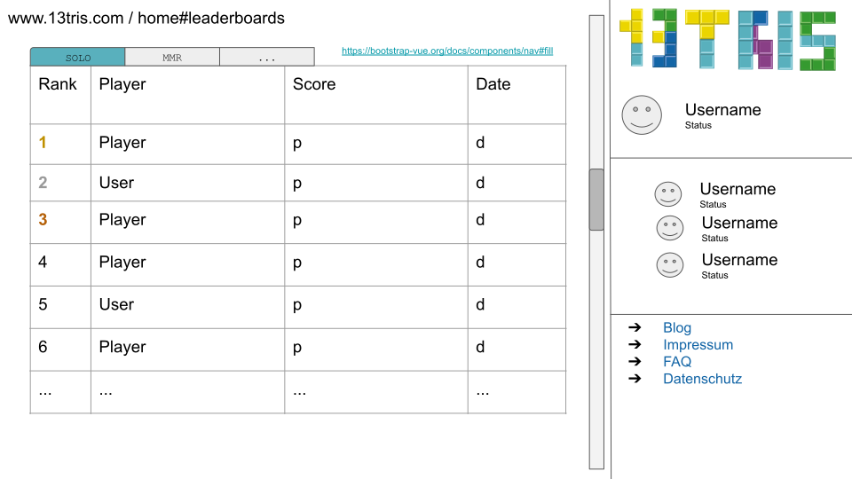
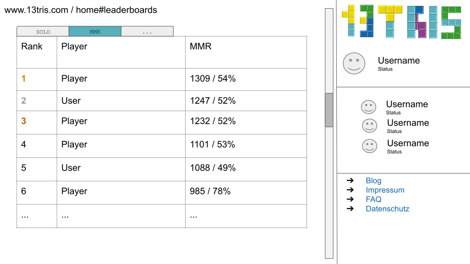

# 1. Use Case Specification: View the leaderboard

## 1.1 Brief Description

This use case allows users to view a leaderboard. 
The user can view different leaderboards based on the game modes.

## 1.2 Mockup

### Viewing the leaderboard on the home page

#1.3 Screenshot
###Leaderboard functionality "mmr"

# 2. Flow of Events

## 2.1 Basic Flow

Here is the activity diagram for viewing the leaderboard.  

## 2.2 Alternative Flows

n/a

# 3. Special Requirements

n/a

# 4. Preconditions

The main preconditions for this use case are:
1. Teh leaderboard has been initialized / updated once

# 5. Postconditions

##5.1

# 6. Extension Points

n/a
