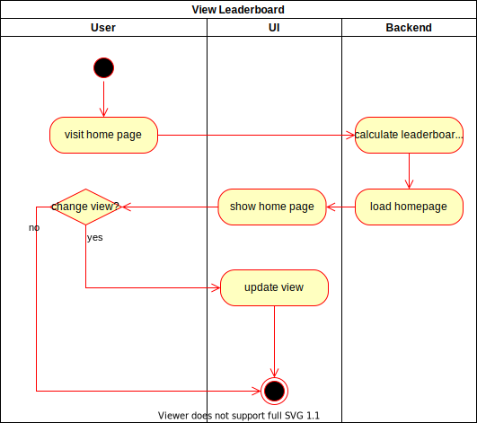

# 1. Use Case Specification: View the leaderboard

## 1.1 Brief Description

This use case allows users to view a leaderboard. 
The user can view different leaderboards based on the game modes.

## 1.2 Mockup

### Viewing the leaderboard on the home page
The leaderboard(s) will be visible within the home page of our application. 
We will have different leaderboards for the different game modes or statistics.


#1.3 Screenshot
###Leaderboard functionality "mmr"
One type of leaderboard we might want to implement is the "MMR" leaderboard which shows the top 
players based on their MMR (Match Making Rating). The MMR might be based on the total number of games
a player played and the win/loss ratio. This only makes sense for the 1vs1 mode of course.


# 2. Flow of Events

## 2.1 Basic Flow

Here is the activity diagram for viewing the leaderboard. If the user visits the home page the different
leaderboards/stats of all the players get calculated and shown on the page. If the user selects a different
tab to view a differetn kind of leaderboard the view will be updated as well. 


## 2.2 Alternative Flows

n/a

## 2.3 Narrative
```gherkin
Feature: View Leaderboard
  As a USER
  I want to view the best players on the leaderboard and filter by various criteria.

  Background:
    Given The user is logged in
    And The user is visiting the home page

  Scenario Outline: Change view
    When I click the tab <tab> above the leaderboard
    Then I should see the user <name>

    Examples:
      | tab  | name      |
      | solo | UserSolo  |
      | mmr  | UserMMR   |
      | 1vs1 | UserOther |
      | bot  | UserOther |
```

# 3. Special Requirements

n/a

# 4. Preconditions

The main preconditions for this use case are:
1. Matches have been played / saved into the database.


# 5. Postconditions

The main preconditions for this use case are:
1. The leaderboard will get updated.

# 6. Extension Points

n/a
